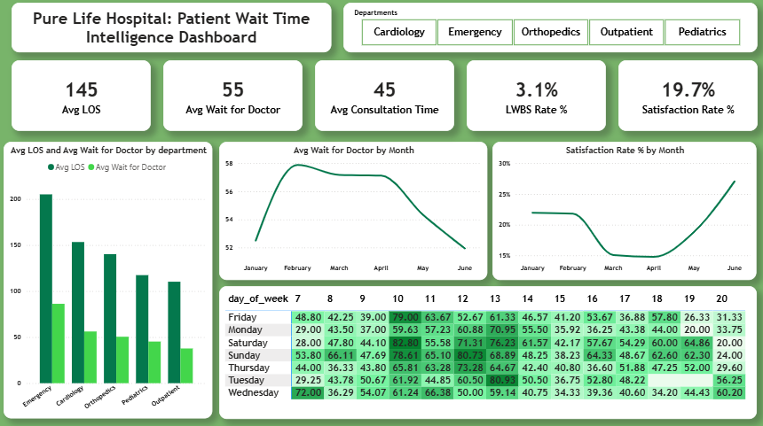

  

# Patient Wait Time Analysis Dashboard

## Overview
This project presents an interactive Power BI dashboard designed to analyse patient wait times within a multi-departmental healthcare setting. The aim is to identify inefficiencies in patient flow, reduce delays, and improve overall clinical efficiency and patient satisfaction.

---

##  Project Context

**Pure Life Hospital** is a multi-departmental healthcare provider operating across:
- Cardiology  
- Emergency  
- Orthopedics  
- Outpatient  
- Pediatrics  

The hospital leverages Electronic Health Record (EHR) data to analyse **time-based patient flow**, tracking the full patient journey from arrival to discharge.

This project focuses on evaluating and optimising **clinical efficiency**, with emphasis on:
- Patient wait times  
- Length of Stay (LOS)  
- Resource utilisation  
- Patient experience  

---

##  Problem Statement

Pure Life Hospital is currently experiencing a critical operational breakdown driven by **excessive patient wait times**, negatively impacting both clinical outcomes and hospital revenue.

Analysis reveals significant **non-value-added time**, where patients spend the majority of their visit waiting rather than receiving care.

Key challenges include:
- Prolonged wait times across departments  
- Misalignment between **patient demand and staffing levels**, especially during peak periods  
- High incidence of **LWBS (Left Without Being Seen)**  
- Extended **Length of Stay (LOS)** reducing patient throughput  
- Persistently **low patient satisfaction rates (~19.7%)**  

These inefficiencies indicate systemic bottlenecks in patient flow and operational planning.

---

##  Project Goal

The goal of this project is to deliver a **data-driven dashboard solution** that:

- Identifies bottlenecks in patient flow  
- Analyses wait time patterns across departments and time periods  
- Monitors key performance indicators (KPIs)  
- Supports data-driven decision-making to improve efficiency and patient outcomes  

---

##  Key Features
- **Wait Time Analysis:** Tracks average and total patient wait times  
- **Patient Satisfaction KPI:** Measures satisfaction levels  
- **Trend Analysis:** Identifies patterns over time  
- **Department-Level Insights:** Compares performance across units  
- **Interactive Visuals:** Enables dynamic filtering and exploration  

---

##  Key Metrics (KPIs)
- Average Wait Time  
- Average Length of Stay (LOS)  
- Average Consultation Time  
- LWBS Rate (%)  
- Patient Satisfaction Rate (%)  

---

##  Key Insights & Results

###  Overall Performance
- **Average Length of Stay (LOS):** 145 minutes  
- **Average Wait Time (Doctor):** 55 minutes  
- **Average Consultation Time:** 45 minutes  
- **LWBS Rate:** 3.1%  
- **Patient Satisfaction Rate:** 19.7%  

---

###  Wait Time Trends
- Wait times peaked at **~58 minutes in February**  
- Reduced to **~52 minutes by June**, indicating improving efficiency  

---

###  Patient Satisfaction Trends
- Satisfaction dropped to **~15% in March–April**  
- Recovered to **~27% by June**  
- Suggests a **relationship between reduced wait times and improved patient experience**  

---

###  Department-Level Insights
- **Emergency Department:**
  - Avg LOS: ~205 minutes  
  - Avg Wait Time: ~85–90 minutes  
- **Cardiology & Orthopedics:**
  - Elevated LOS (~140–155 minutes)  
- **Outpatient:**
  - Lower wait times and improved flow  

 **Emergency identified as the primary bottleneck**

---

###  Critical Insight: Patient Experience Gap
Despite operational improvements:
- Overall satisfaction remains low at **19.7%**  
- Indicates a gap between **service delivery and patient expectations**  
- Suggests that factors beyond wait time (e.g., communication, care quality) influence satisfaction  

---

##  Business Impact

This analysis provides actionable insights that enable healthcare providers to:

- **Reduce patient wait times** through targeted interventions  
- **Improve patient throughput** by addressing bottlenecks  
- **Optimise staff allocation** during peak demand periods  
- **Enhance patient satisfaction** by improving both efficiency and experience  
- **Minimise revenue loss** associated with LWBS cases  
- **Support sustainable operations**, reducing risk of staff burnout  

---

##  Tools & Technologies
- **Power BI** – Dashboard development and visualisation  
- **DAX (Data Analysis Expressions)** – KPI calculations  
- **Data Modelling** – Structured dataset for analysis  

---

##  Dataset
The dataset consists of anonymised patient records, including:
- Arrival time  
- Consultation start time  
- Wait duration  
- Length of stay  
- Patient satisfaction indicator  

---

## Author
**Edwina Abam**  
Data Analyst | Machine Learning | Healthcare Analytics  
